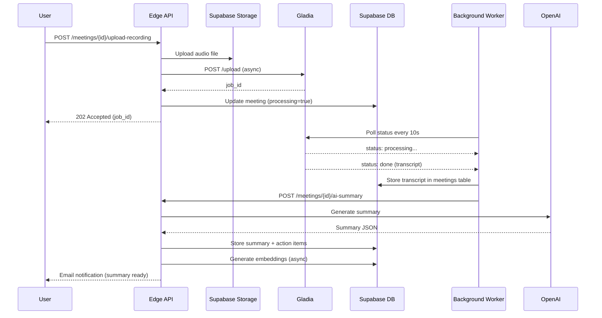
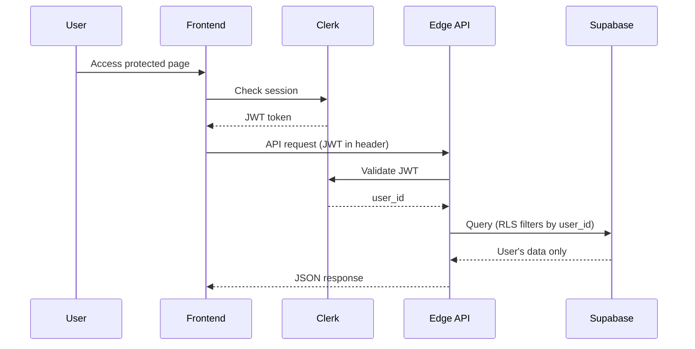

# Backend Architecture

**Version:** 2.0 (Updated for Client Memory Pivot)
**Last Updated:** January 6, 2026

## Service Architecture

### API Route Organization

```
app/api/
├── auth/
│   ├── webhook/
│   │   └── route.ts              # Clerk webhook for user sync
│   └── session.ts                # Session validation utilities
├── clients/
│   ├── route.ts                  # GET (list) / POST (create)
│   ├── [id]/
│   │   ├── route.ts              # GET / PUT / DELETE specific client
│   │   ├── meetings/
│   │   │   └── route.ts          # GET meetings for client
│   │   ├── action-items/
│   │   │   └── route.ts          # GET action items for client
│   │   └── research/
│   │       └── route.ts          # POST trigger AI research (website scraping)
├── meetings/
│   ├── route.ts                  # GET (list) / POST (create/log)
│   ├── [id]/
│   │   ├── route.ts              # GET / PUT / DELETE specific meeting
│   │   ├── upload-transcript/
│   │   │   └── route.ts          # POST upload transcript file
│   │   ├── upload-recording/
│   │   │   └── route.ts          # POST upload recording file → trigger Gladia
│   │   └── ai-summary/
│   │       └── route.ts          # POST generate AI summary
├── action-items/
│   ├── route.ts                  # GET (list) / POST (create)
│   └── [id]/
│       └── route.ts              # GET / PUT / DELETE specific action item
├── assistant/
│   ├── chat/
│   │   └── route.ts              # POST RAG-powered AI chat query
│   └── prepare/
│       └── route.ts              # POST generate meeting preparation brief
├── webhooks/
│   ├── clerk/
│   │   └── route.ts              # Clerk user sync webhook
│   ├── stripe/
│   │   └── route.ts              # Stripe subscription webhook
│   └── gladia/
│       └── route.ts              # Gladia transcription completion callback
├── user/
│   ├── preferences/
│   │   └── route.ts              # GET / PUT user preferences & limits
│   └── usage/
│       └── route.ts              # GET current month's AI usage stats
└── health/
    └── route.ts                  # Health check endpoint
```

---

## Core API Endpoints

### 1. Clients API

**Base Path:** `/api/clients`

#### GET /api/clients
List all clients for authenticated user

```typescript
// Query params: ?status=active&tag=important&search=acme
Response: {
  clients: Client[],
  total: number,
  page: number,
  limit: number
}
```

#### POST /api/clients
Create new client

```typescript
Request: {
  name: string,
  company?: string,
  role?: string,
  email?: string,
  phone?: string,
  website?: string,
  linkedin_url?: string,
  tags?: string[]
}

Response: {
  client: Client
}
```

#### GET /api/clients/[id]
Get single client with full details

```typescript
Response: {
  client: Client,
  meetings_count: number,
  last_meeting: Meeting | null,
  open_action_items: number
}
```

#### PUT /api/clients/[id]
Update client info

#### DELETE /api/clients/[id]
Delete client (cascade deletes meetings, action items, embeddings)

---

### 2. Meetings API

**Base Path:** `/api/meetings`

#### GET /api/meetings
List all meetings for user

```typescript
// Query params: ?client_id=uuid&from=2026-01-01&to=2026-01-31
Response: {
  meetings: Meeting[],
  total: number
}
```

#### POST /api/meetings
Create new meeting log

```typescript
Request: {
  client_id: string,
  title: string,
  date: string (ISO date),
  duration_minutes?: number,
  platform?: 'google_meet' | 'zoom' | 'teams' | 'other',
  meeting_url?: string,
  notes?: string
}

Response: {
  meeting: Meeting
}
```

#### POST /api/meetings/[id]/upload-recording
Upload meeting recording → triggers async Gladia transcription

```typescript
Request: FormData {
  file: File (audio/video, max 2GB)
}

Response: {
  meeting_id: string,
  upload_path: string,
  transcription_job_id: string,
  status: 'processing'
}
```

#### POST /api/meetings/[id]/ai-summary
Generate AI summary from transcript

```typescript
Request: {
  meeting_id: string
}

Response: {
  summary: {
    overview: string,
    key_points: string[],
    decisions: string[],
    next_steps: string[]
  },
  action_items: ActionItem[]
}
```

---

### 3. Action Items API

**Base Path:** `/api/action-items`

#### GET /api/action-items
List action items with filters

```typescript
// Query params: ?status=to_prepare&client_id=uuid&overdue=true
Response: {
  action_items: ActionItem[],
  total: number
}
```

#### POST /api/action-items
Create manual action item

```typescript
Request: {
  client_id: string,
  meeting_id?: string,
  description: string,
  priority?: 'low' | 'medium' | 'high',
  due_date?: string (ISO date),
  status?: 'to_prepare' | 'promised' | 'done'
}

Response: {
  action_item: ActionItem
}
```

#### PUT /api/action-items/[id]
Update action item (e.g., mark as done)

---

### 4. AI Assistant API

**Base Path:** `/api/assistant`

#### POST /api/assistant/chat
RAG-powered AI chat query

```typescript
Request: {
  question: string,
  client_id?: string, // Optional: scope to specific client
  conversation_id?: string // Optional: continue conversation
}

Response: {
  answer: string,
  sources: {
    meeting_id: string,
    content: string,
    relevance_score: number
  }[],
  conversation_id: string
}
```

**Flow:**
1. Embed user question with OpenAI
2. Similarity search in pgvector (top 5 relevant chunks)
3. Send question + retrieved context to GPT-4o-mini
4. Return answer with source citations

#### POST /api/assistant/prepare
Generate meeting preparation brief

```typescript
Request: {
  client_id: string,
  upcoming_meeting_date?: string
}

Response: {
  client_summary: string,
  last_meeting_recap: string,
  open_action_items: ActionItem[],
  suggested_talking_points: string[],
  context_notes: string
}
```

---

## Background Jobs & Async Processing

### Gladia Transcription Flow



**Implementation:**
- Use Vercel cron jobs or Supabase Edge Functions for polling
- Alternative: Gladia webhook (if supported)
- Timeout: 1 hour max processing time
- Error handling: If transcription fails, notify user, allow manual transcript upload

---

## Authentication & Authorization

### Auth Flow



**Security:**
- All API routes protected with `auth()` middleware from Clerk
- Supabase RLS policies enforce user isolation
- Never trust client-provided `user_id` – always use JWT-verified Clerk user ID
- API keys (OpenAI, Gladia) never exposed to frontend

---

## Error Handling Standard

### Error Response Format

```typescript
interface ErrorResponse {
  error: {
    code: string;
    message: string;
    details?: Record<string, any>;
  };
}
```

### Error Codes

| Code | HTTP Status | Meaning |
|------|-------------|---------|
| `UNAUTHORIZED` | 401 | No valid JWT token |
| `FORBIDDEN` | 403 | User not allowed to access resource |
| `NOT_FOUND` | 404 | Resource doesn't exist or RLS blocked |
| `INVALID_INPUT` | 400 | Zod validation failed |
| `RATE_LIMIT_EXCEEDED` | 429 | User exceeded tier limits |
| `EXTERNAL_API_ERROR` | 502 | Gladia/OpenAI failed |
| `INTERNAL_ERROR` | 500 | Unexpected server error |

### Example Error Response

```json
{
  "error": {
    "code": "RATE_LIMIT_EXCEEDED",
    "message": "You've reached your monthly AI meeting limit (3/3). Upgrade to Pro for 20 AI meetings/month.",
    "details": {
      "current_usage": 3,
      "limit": 3,
      "tier": "free",
      "reset_date": "2026-02-01"
    }
  }
}
```

---

## Tier Enforcement Middleware

**Check limits before expensive AI operations:**

```typescript
// middleware/tierCheck.ts
export async function checkAIMeetingLimit(userId: string) {
  const { data: prefs } = await supabase
    .from('user_preferences')
    .select('ai_meetings_this_month, max_ai_meetings_per_month, tier')
    .eq('user_id', userId)
    .single();

  if (prefs.ai_meetings_this_month >= prefs.max_ai_meetings_per_month) {
    throw new Error('RATE_LIMIT_EXCEEDED');
  }

  // Increment counter
  await supabase
    .from('user_preferences')
    .update({ ai_meetings_this_month: prefs.ai_meetings_this_month + 1 })
    .eq('user_id', userId);
}
```

**Usage tracking:**
- Track AI API calls in `ai_usage_tracking` table
- Reset monthly counters on 1st of each month (cron job)
- Enforce limits in API layer BEFORE calling external APIs

---

## Database Connection Pattern

**Use Supabase service role key for admin operations:**

```typescript
import { createClient } from '@supabase/supabase-js';

export const supabaseAdmin = createClient(
  process.env.NEXT_PUBLIC_SUPABASE_URL!,
  process.env.SUPABASE_SERVICE_ROLE_KEY!, // Admin key
  {
    auth: {
      autoRefreshToken: false,
      persistSession: false
    }
  }
);

// For RLS-enforced queries (use Clerk user ID)
export function getSupabaseClient(userId: string) {
  const supabase = createClient(
    process.env.NEXT_PUBLIC_SUPABASE_URL!,
    process.env.SUPABASE_ANON_KEY!
  );

  // Set RLS context
  supabase.auth.setAuth(userId);

  return supabase;
}
```

---

## Edge Function Template (TypeScript)

```typescript
// app/api/clients/route.ts
import { NextRequest, NextResponse } from 'next/server';
import { auth } from '@clerk/nextjs';
import { z } from 'zod';
import { supabaseAdmin } from '@/lib/supabase';

// Validation schema
const CreateClientSchema = z.object({
  name: z.string().min(2).max(100),
  company: z.string().max(100).optional(),
  email: z.string().email().optional(),
  website: z.string().url().optional(),
  tags: z.array(z.string()).max(3).optional()
});

// POST /api/clients - Create client
export async function POST(request: NextRequest) {
  try {
    // 1. Auth check
    const { userId } = auth();
    if (!userId) {
      return NextResponse.json(
        { error: { code: 'UNAUTHORIZED', message: 'Authentication required' } },
        { status: 401 }
      );
    }

    // 2. Validate input
    const body = await request.json();
    const validation = CreateClientSchema.safeParse(body);

    if (!validation.success) {
      return NextResponse.json(
        { error: { code: 'INVALID_INPUT', message: 'Validation failed', details: validation.error } },
        { status: 400 }
      );
    }

    const data = validation.data;

    // 3. Check tier limits
    const { data: prefs } = await supabaseAdmin
      .from('user_preferences')
      .select('clients_count, max_clients, tier')
      .eq('user_id', userId)
      .single();

    if (prefs.clients_count >= prefs.max_clients) {
      return NextResponse.json(
        { error: {
          code: 'RATE_LIMIT_EXCEEDED',
          message: `Client limit reached (${prefs.max_clients}). Upgrade to Pro.`,
          details: { current: prefs.clients_count, limit: prefs.max_clients, tier: prefs.tier }
        }},
        { status: 429 }
      );
    }

    // 4. Create client (RLS auto-enforces user_id)
    const { data: client, error } = await supabaseAdmin
      .from('clients')
      .insert({ ...data, user_id: userId })
      .select()
      .single();

    if (error) throw error;

    // 5. Update client count
    await supabaseAdmin
      .from('user_preferences')
      .update({ clients_count: prefs.clients_count + 1 })
      .eq('user_id', userId);

    // 6. Return success
    return NextResponse.json({ client }, { status: 201 });

  } catch (error) {
    console.error('API Error:', error);
    return NextResponse.json(
      { error: { code: 'INTERNAL_ERROR', message: 'Internal server error' } },
      { status: 500 }
    );
  }
}
```

---

## Performance Optimization

### Caching Strategy
- **Client list:** Cache for 5 minutes (rarely changes)
- **AI summaries:** Never regenerate, cache indefinitely
- **Embeddings:** Generate once, reuse forever
- **Usage stats:** Cache per-request (reset monthly anyway)

### Database Indexes
All critical indexes defined in `database-schema.md`:
- `clients(user_id, created_at DESC)` for dashboard
- `meetings(client_id, date DESC)` for client detail view
- `embeddings(user_id, embedding vector_cosine_ops)` for RAG search

### API Rate Limiting
- Global: 100 req/min per IP (Vercel middleware)
- Per-user: Tier-based limits enforced in API layer
- External APIs: Retry with exponential backoff

---

## Monitoring & Logging

**Sentry Error Tracking:**
- Capture all 500 errors
- Track external API failures (Gladia, OpenAI)
- Alert on high error rates

**Custom Logging:**
```typescript
// Track AI usage costs
await supabaseAdmin
  .from('ai_usage_tracking')
  .insert({
    user_id: userId,
    service: 'openai',
    operation: 'summary',
    tokens_used: 1234,
    cost_usd: 0.025,
    meeting_id: meetingId
  });
```

**Health Check Endpoint:**
```typescript
// GET /api/health
export async function GET() {
  const checks = {
    supabase: await checkSupabase(),
    openai: await checkOpenAI(),
    timestamp: new Date().toISOString()
  };

  const allHealthy = Object.values(checks).every(v => v === true);

  return NextResponse.json(checks, {
    status: allHealthy ? 200 : 503
  });
}
```
