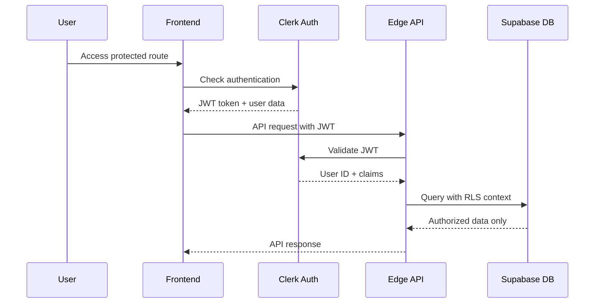

# Backend Architecture

### Service Architecture

#### Function Organization

```
api/
├── auth/
│   ├── webhook.ts              # Clerk webhook for user sync
│   └── session.ts              # Session validation utilities
├── meetings/
│   ├── route.ts                # GET /POST meetings
│   ├── [id]/
│   │   ├── route.ts            # GET/PATCH specific meeting
│   │   ├── join/
│   │   │   └── route.ts        # POST join meeting
│   │   ├── participants/
│   │   │   └── route.ts        # GET/PATCH participants
│   │   └── ai/
│   │       ├── summary/
│   │       │   └── route.ts    # POST AI summary generation
│   │       └── translate/
│   │           └── route.ts    # POST translation
├── webhooks/
│   ├── clerk/
│   │   └── route.ts            # Clerk user sync webhook
│   ├── paddle/
│   │   └── route.ts            # Paddle payment webhook
│   └── razorpay/
│       └── route.ts            # Razorpay payment webhook
└── health/
    └── route.ts                # Health check endpoint
```

#### Function Template

```typescript
// app/api/meetings/[id]/route.ts - Standard Edge Function template
import { NextRequest, NextResponse } from 'next/server';
import { auth } from '@clerk/nextjs';
import { createClient } from '@supabase/supabase-js';
import { z } from 'zod';

// Request validation schemas
const GetMeetingSchema = z.object({
  id: z.string().uuid(),
});

// GET /api/meetings/[id] - Get meeting details
export async function GET(
  request: NextRequest,
  { params }: { params: { id: string } }
) {
  try {
    // Authentication
    const { userId } = auth();
    if (!userId) {
      return NextResponse.json(
        { error: { code: 'UNAUTHORIZED', message: 'Authentication required' } },
        { status: 401 }
      );
    }

    // Validation
    const validation = GetMeetingSchema.safeParse(params);
    if (!validation.success) {
      return NextResponse.json(
        { error: { code: 'INVALID_INPUT', message: 'Invalid meeting ID' } },
        { status: 400 }
      );
    }

    const { id: meetingId } = validation.data;

    // Database query with RLS
    const supabase = createClient(
      process.env.NEXT_PUBLIC_SUPABASE_URL!,
      process.env.SUPABASE_SERVICE_ROLE_KEY!
    );

    const { data: meeting, error } = await supabase
      .from('meetings')
      .select('*')
      .eq('id', meetingId)
      .single();

    if (error || !meeting) {
      return NextResponse.json(
        { error: { code: 'NOT_FOUND', message: 'Meeting not found' } },
        { status: 404 }
      );
    }

    return NextResponse.json(meeting);
  } catch (error) {
    console.error('API Error:', error);
    return NextResponse.json(
      { error: { code: 'INTERNAL_ERROR', message: 'Internal server error' } },
      { status: 500 }
    );
  }
}
```

### Authentication and Authorization

#### Auth Flow



