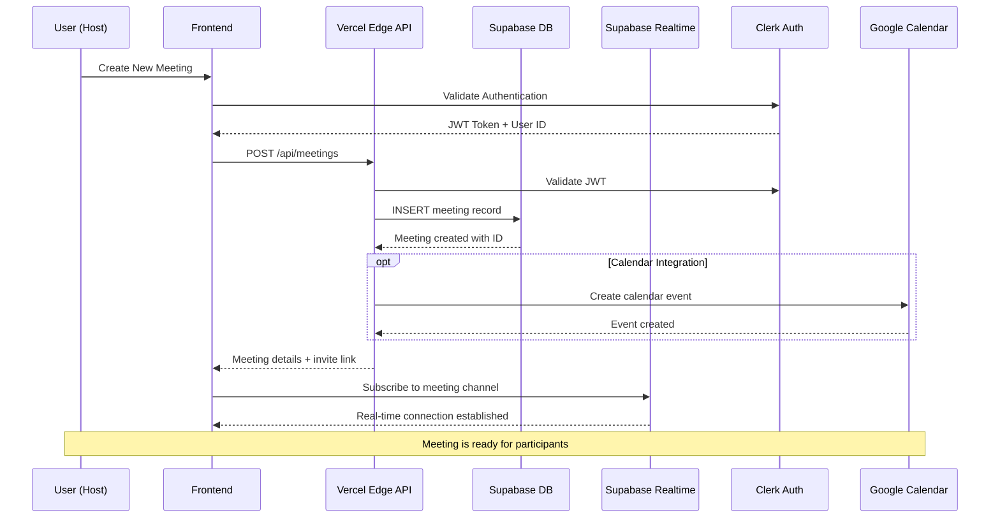
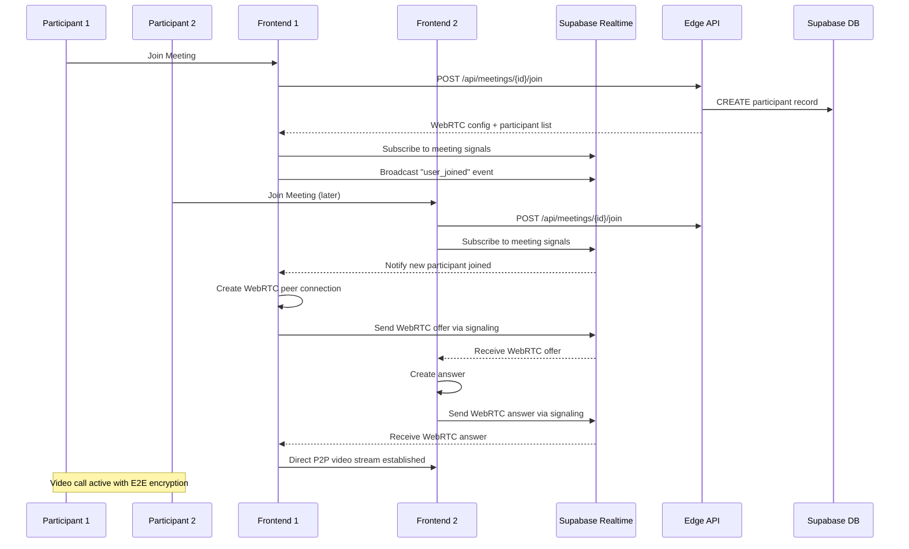
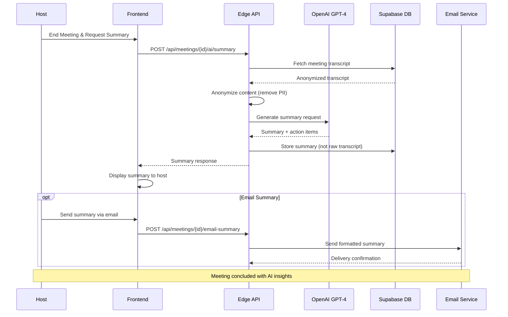

# Core Workflows

### Meeting Creation and Join Workflow

```mermaid
sequenceDiagram
    participant U as User (Host)
    participant FE as Frontend
    participant API as Vercel Edge API
    participant DB as Supabase DB
    participant RT as Supabase Realtime
    participant C as Clerk Auth
    participant GC as Google Calendar

    U->>FE: Create New Meeting
    FE->>C: Validate Authentication
    C-->>FE: JWT Token + User ID

    FE->>API: POST /api/meetings
    API->>C: Validate JWT
    API->>DB: INSERT meeting record
    DB-->>API: Meeting created with ID

    opt Calendar Integration
        API->>GC: Create calendar event
        GC-->>API: Event created
    end

    API-->>FE: Meeting details + invite link
    FE->>RT: Subscribe to meeting channel
    RT-->>FE: Real-time connection established

    Note over U,GC: Meeting is ready for participants
```

### Video Call Initiation with WebRTC Signaling

```mermaid
sequenceDiagram
    participant P1 as Participant 1
    participant P2 as Participant 2
    participant FE1 as Frontend 1
    participant FE2 as Frontend 2
    participant RT as Supabase Realtime
    participant API as Edge API
    participant DB as Supabase DB

    P1->>FE1: Join Meeting
    FE1->>API: POST /api/meetings/{id}/join
    API->>DB: CREATE participant record
    API-->>FE1: WebRTC config + participant list

    FE1->>RT: Subscribe to meeting signals
    FE1->>RT: Broadcast "user_joined" event

    P2->>FE2: Join Meeting (later)
    FE2->>API: POST /api/meetings/{id}/join
    FE2->>RT: Subscribe to meeting signals

    RT-->>FE1: Notify new participant joined
    FE1->>FE1: Create WebRTC peer connection
    FE1->>RT: Send WebRTC offer via signaling

    RT-->>FE2: Receive WebRTC offer
    FE2->>FE2: Create answer
    FE2->>RT: Send WebRTC answer via signaling

    RT-->>FE1: Receive WebRTC answer
    FE1->>FE2: Direct P2P video stream established

    Note over P1,P2: Video call active with E2E encryption
```

### AI-Powered Meeting Summary Generation

```mermaid
sequenceDiagram
    participant H as Host
    participant FE as Frontend
    participant API as Edge API
    participant AI as OpenAI GPT-4
    participant DB as Supabase DB
    participant Email as Email Service

    H->>FE: End Meeting & Request Summary
    FE->>API: POST /api/meetings/{id}/ai/summary
    API->>DB: Fetch meeting transcript
    DB-->>API: Anonymized transcript

    API->>API: Anonymize content (remove PII)
    API->>AI: Generate summary request
    AI-->>API: Summary + action items

    API->>DB: Store summary (not raw transcript)
    API-->>FE: Summary response
    FE->>FE: Display summary to host

    opt Email Summary
        H->>FE: Send summary via email
        FE->>API: POST /api/meetings/{id}/email-summary
        API->>Email: Send formatted summary
        Email-->>API: Delivery confirmation
    end

    Note over H,Email: Meeting concluded with AI insights
```

