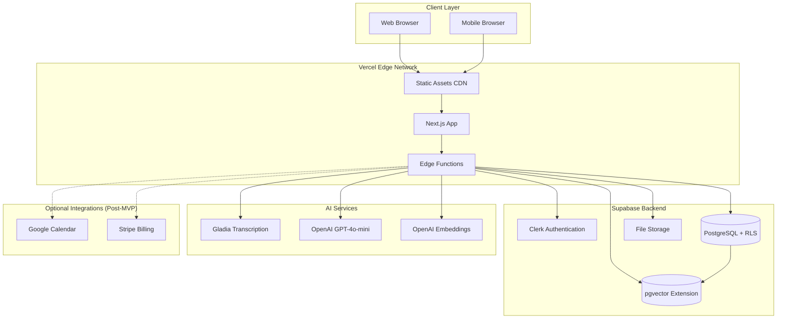

# High Level Architecture

**Version:** 2.0 (Updated for Client Memory Pivot)
**Last Updated:** January 6, 2026

### Technical Summary

MeetSolis follows a **Jamstack serverless architecture** deployed on Vercel's free tier with Supabase as the backend-as-a-service. The frontend is a Next.js 14 application using App Router for optimal SSR/SSG performance, while the backend leverages Vercel Edge Functions and Supabase PostgreSQL with pgvector extension for RAG-powered AI features. Gladia handles audio transcription from uploaded meeting recordings, OpenAI GPT-4 generates summaries and powers the AI assistant, and all client data remains private within the user's Supabase tenant. The system is designed to operate within free tier constraints while supporting the MVP target of 50-100 users.

### Platform and Infrastructure Choice

**Platform:** Vercel + Supabase (Free Tiers)
**Key Services:** Vercel Edge Functions, Supabase PostgreSQL + pgvector, Supabase Storage, Clerk Authentication
**AI Services:** Gladia (transcription), OpenAI GPT-4 (summaries, RAG, research)
**Deployment Host and Regions:** Vercel Edge Network (Global), Supabase US-East-1

### Repository Structure

**Structure:** Monorepo with Next.js App Router
**Monorepo Tool:** npm workspaces (built-in, no additional tooling overhead)
**Package Organization:** Apps-focused with shared packages for types and utilities

### High Level Architecture Diagram

### Architectural Patterns

- **Jamstack Architecture:** Static site generation with serverless APIs - _Rationale:_ Optimal performance and cost efficiency for free tier constraints
- **Component-Based UI:** Reusable React components with TypeScript - _Rationale:_ Maintainability and type safety across client management interface
- **Backend-for-Frontend (BFF):** Vercel Edge Functions as API layer - _Rationale:_ Abstracts external APIs (Gladia, OpenAI) and enforces security policies
- **RAG (Retrieval-Augmented Generation):** pgvector for semantic search - _Rationale:_ AI assistant with full context from client meetings and notes
- **Async Processing:** Background jobs for transcription/summarization - _Rationale:_ Don't block user while processing large audio files
- **Row-Level Security (RLS):** Database-level access control - _Rationale:_ Multi-tenant security, each user sees only their clients/meetings
- **Client-Centric Data Model:** All data organized around client cards - _Rationale:_ Core product value is client context and memory

