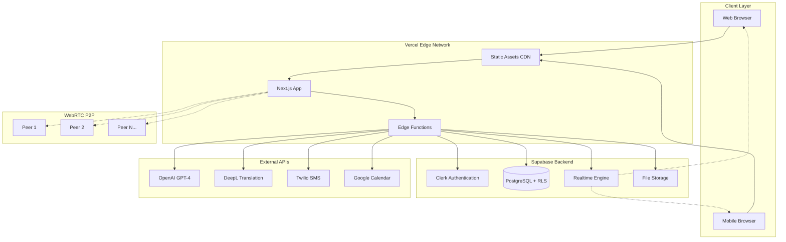

# High Level Architecture

### Technical Summary

MeetSolis follows a **Jamstack serverless architecture** deployed on Vercel's free tier with Supabase as the backend-as-a-service. The frontend is a Next.js 14 application using App Router for optimal SSR/SSG performance, while the backend leverages Vercel Edge Functions and Supabase's real-time capabilities. WebRTC handles peer-to-peer video communication with DTLS/SRTP encryption, while Supabase Realtime manages collaborative features like whiteboard synchronization and messaging. AI integrations (OpenAI, DeepL) are proxied through Vercel Edge Functions to maintain security, and the entire system is designed to operate within free tier constraints while supporting up to 1,000 users at ~$185/month operational costs.

### Platform and Infrastructure Choice

**Platform:** Vercel + Supabase (Free Tiers)
**Key Services:** Vercel Edge Functions, Supabase PostgreSQL, Supabase Realtime, Supabase Storage, Clerk Authentication
**Deployment Host and Regions:** Vercel Edge Network (Global), Supabase US-East-1

### Repository Structure

**Structure:** Monorepo with Next.js App Router
**Monorepo Tool:** npm workspaces (built-in, no additional tooling overhead)
**Package Organization:** Apps-focused with shared packages for types and utilities

### High Level Architecture Diagram

### Architectural Patterns

- **Jamstack Architecture:** Static site generation with serverless APIs - _Rationale:_ Optimal performance and cost efficiency for free tier constraints
- **Component-Based UI:** Reusable React components with TypeScript - _Rationale:_ Maintainability and type safety across large video conferencing interface
- **Backend-for-Frontend (BFF):** Vercel Edge Functions as API layer - _Rationale:_ Abstracts external APIs and enforces security policies
- **Event-Driven Real-time:** Supabase Realtime for collaborative features - _Rationale:_ Essential for whiteboard, messaging, and participant management
- **Peer-to-Peer Communication:** WebRTC for direct video streams - _Rationale:_ Reduces server load and improves latency within free tier limits
- **Row-Level Security (RLS):** Database-level access control - _Rationale:_ Multi-tenant security without complex authorization logic

