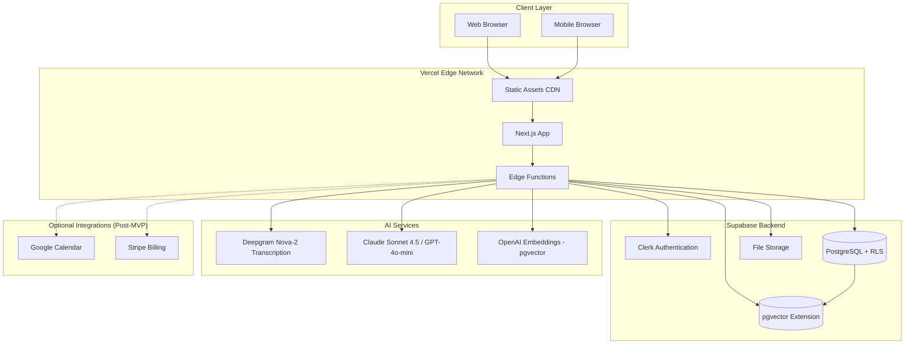

# High Level Architecture

**Version:** 3.2 (Post-Meeting Intelligence Platform for Executive Coaches)
**Last Updated:** April 11, 2026

### Technical Summary

MeetSolis follows a **Jamstack serverless architecture** deployed on Vercel Pro with Supabase Pro as the backend-as-a-service. The frontend is a Next.js 14 application using App Router, while the backend leverages Vercel Edge Functions and Supabase PostgreSQL with pgvector for hybrid RAG. Deepgram Nova-2 handles audio/video transcription with speaker diarization (coach vs. client), Claude Sonnet 4.5 generates coaching-specific summaries and powers Solis Intelligence, and all client data remains private within the user's Supabase tenant. Baseline infra cost: ~$100/mo (Vercel Pro + Supabase Pro + Resend + misc).

### Platform and Infrastructure Choice

**Platform:** Vercel Pro + Supabase Pro (~$100/mo baseline)
**Key Services:** Vercel Edge Functions, Supabase PostgreSQL + pgvector, Supabase Storage, Clerk Authentication, Resend (email)
**AI Services:** Deepgram Nova-2 (transcription), Claude Sonnet 4.5 default / GPT-4o-mini fallback (summaries + Solis Intelligence RAG)
**Deployment Host and Regions:** Vercel Edge Network (Global), Supabase US-East-1

### Repository Structure

**Structure:** Monorepo with Next.js App Router
**Monorepo Tool:** npm workspaces (built-in, no additional tooling overhead)
**Package Organization:** Apps-focused with shared packages for types and utilities

### High Level Architecture Diagram

```mermaid
graph TB
    subgraph "Client Layer"
        WEB[Web Browser]
        MOBILE[Mobile Browser]
    end

    subgraph "Vercel Edge Network"
        CDN[Static Assets CDN]
        EDGE[Edge Functions]
        NEXTJS[Next.js App]
    end

    subgraph "Supabase Backend"
        AUTH[Clerk Authentication]
        DB[(PostgreSQL + RLS)]
        VECTOR[(pgvector Extension)]
        STORAGE[File Storage]
    end

    subgraph "AI Services"
        DEEPGRAM[Deepgram Nova-2 Transcription]
        AI[Claude Sonnet 4.5 / GPT-4o-mini]
        EMBEDDINGS[OpenAI Embeddings - pgvector]
    end

    subgraph "Optional Integrations (Post-MVP)"
        GCAL[Google Calendar]
        STRIPE[Stripe Billing]
    end

    WEB --> CDN
    MOBILE --> CDN
    CDN --> NEXTJS
    NEXTJS --> EDGE
    EDGE --> AUTH
    EDGE --> DB
    EDGE --> VECTOR
    EDGE --> STORAGE

    EDGE --> DEEPGRAM
    EDGE --> AI
    EDGE --> EMBEDDINGS
    EDGE -.-> GCAL
    EDGE -.-> STRIPE

    DB --> VECTOR
```

### Architectural Patterns

- **Jamstack Architecture:** Static site generation with serverless APIs - _Rationale:_ Optimal performance and cost efficiency for free tier constraints
- **Component-Based UI:** Reusable React components with TypeScript - _Rationale:_ Maintainability and type safety across client management interface
- **Backend-for-Frontend (BFF):** Vercel Edge Functions as API layer - _Rationale:_ Abstracts external APIs (Deepgram, Claude/OpenAI) and enforces security policies
- **RAG (Retrieval-Augmented Generation):** pgvector for semantic search - _Rationale:_ AI assistant with full context from client meetings and notes
- **Async Processing:** Background jobs for transcription/summarization - _Rationale:_ Don't block user while processing large audio files
- **Row-Level Security (RLS):** Database-level access control - _Rationale:_ Multi-tenant security, each user sees only their clients/meetings
- **Client-Centric Data Model:** All data organized around client cards - _Rationale:_ Core product value is client context and memory

