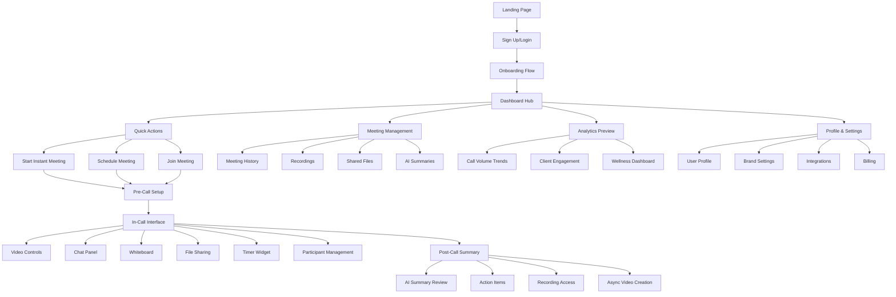
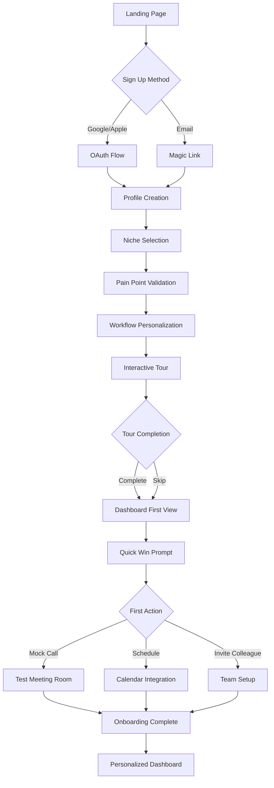
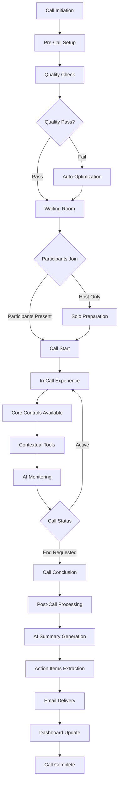
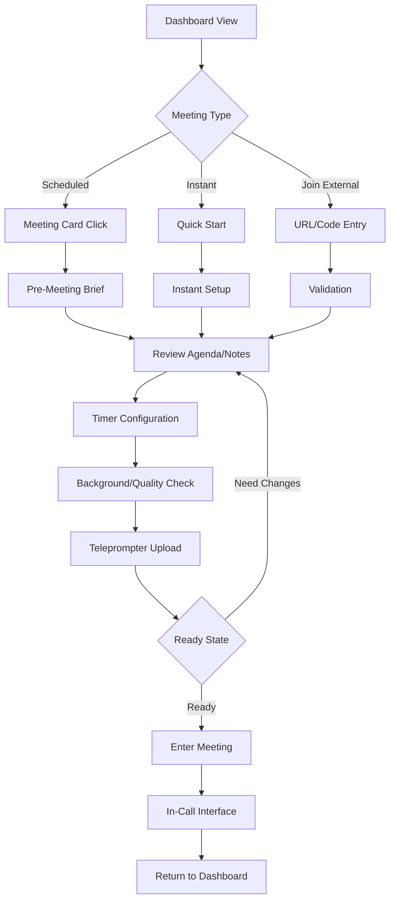

# MeetSolis UI/UX Specification

## Introduction

This document defines the user experience goals, information architecture, user flows, and visual design specifications for MeetSolis's user interface. It serves as the foundation for visual design and frontend development, ensuring a cohesive and user-centered experience.

Based on the comprehensive PRD analysis, MeetSolis is positioned as a **premium Zoom alternative specifically designed for freelancers and small-medium agencies** (2-10 employees) who conduct frequent client video calls. The platform addresses critical pain points: unprofessional call experiences, scope creep, billing inefficiencies, and client trust issues through specialized tools and a single, affordable plan ($12-15/month).

### Change Log

| Date | Version | Description | Author |
|------|---------|-------------|---------|
| 2025-01-20 | 1.0 | Initial UI/UX specification for Epic 1-2 MVP | UX Expert |

## Overall UX Goals & Principles

### Target User Personas

**Primary Persona - The Professional Freelancer:**
- Independent designers, marketers, consultants conducting 5-15 client calls weekly
- Values: Professional credibility, time efficiency, burnout prevention
- Pain Points: Zoom fatigue, scope creep, manual note-taking, technical glitches
- Context: Working from home/co-working spaces, often back-to-back calls

**Secondary Persona - Small Agency Owner:**
- Managing 2-10 team members with multiple client accounts
- Values: Team collaboration, client satisfaction metrics, scalable processes
- Pain Points: Tool complexity, inconsistent client experiences across team
- Context: Hybrid work environments, need for team coordination features

**Tertiary Persona - International Freelancer:**
- Global clients requiring translation and cultural sensitivity
- Values: Clear communication, professional appearance despite location
- Pain Points: Language barriers, timezone coordination, background noise
- Context: Diverse home office setups, varying internet connectivity

### Usability Goals

**Critical Success Metrics:**
- **Onboarding Efficiency:** New users complete first successful call within 5 minutes
- **Call Setup Speed:** 20% reduction in pre-call preparation time vs. competitors
- **Professional Credibility:** Virtual backgrounds and quality checks boost client confidence
- **Feature Adoption:** 80% of users actively use 3+ core features within first week
- **Retention:** <10% monthly churn through burnout prevention and wellness features

### Design Principles

1. **Minimalism-First, Premium Feel** - Reduce cognitive load while enhancing professional credibility through sparse elegance inspired by ChatGPT and Notion
2. **One-Click Professionalism** - Pre-call quality checks, background optimization, and teleprompter setup accessible with single interactions
3. **Contextual Tool Access** - Whiteboard, file sharing, and timers appear contextually during calls without cluttering the interface
4. **Gentle Guidance** - Non-intrusive notifications and fatigue alerts that suggest rather than demand attention
5. **Adaptive Personalization** - Interface elements adjust based on user role (freelancer vs. agency) and frequently used features

## Information Architecture (IA)

### Site Map / Screen Inventory



### Navigation Structure

**Primary Navigation:** Persistent sidebar (desktop) featuring core sections:
- **Dashboard** (home icon) - Central hub with personalized content
- **Meetings** (video icon) - History, recordings, scheduling
- **Tools** (grid icon) - AI features, whiteboard, file management
- **Analytics** (chart icon) - Performance insights, wellness tracking
- **Settings** (gear icon) - Profile, integrations, billing

**Secondary Navigation:** Context-sensitive based on current section:
- **Dashboard:** Quick action buttons (Start Call, Schedule, Join)
- **Meetings:** Filter tabs (Upcoming, Past, Recordings, Files)
- **In-Call:** Floating toolbar with essential controls (mute, video, share, whiteboard, end)

**Breadcrumb Strategy:** Minimal breadcrumbs for deep navigation paths only:
- Dashboard > Meeting History > [Meeting Name] > Recording
- Settings > Integrations > Google Calendar Setup

## User Flows

### Epic 1: User Onboarding & Authentication Flow

**User Goal:** Successfully sign up, authenticate, and complete initial setup to prepare for first client call

**Entry Points:** Landing page CTA, referral links, organic search

**Success Criteria:** User completes profile setup and feels confident to schedule their first meeting within 5 minutes

#### Flow Diagram



#### Edge Cases & Error Handling:
- OAuth failure: Graceful fallback to email signup with clear error messaging
- Incomplete profile: Save progress and allow return with reminder email
- Integration failures: Defer calendar/tool connections to post-onboarding
- Browser compatibility: Progressive enhancement with WebRTC feature detection
- Network interruption: Offline-capable PWA with sync on reconnection

**Notes:** Onboarding prioritizes empathy validation over feature tours, directly addressing the PRD's focus on freelancer pain points (scope creep, burnout, unprofessional experiences). The flow is designed to be completable in under 5 minutes while collecting personalization data for dashboard customization.

### Epic 2: Core Video Call Flow

**User Goal:** Start, conduct, and conclude a professional client video call with enhanced productivity tools

**Entry Points:** Dashboard quick action, scheduled meeting notification, direct meeting URL

**Success Criteria:** HD video call completed with <1% failure rate, professional experience maintained, post-call materials automatically generated

#### Flow Diagram



#### Edge Cases & Error Handling:
- WebRTC connection failure: Automatic retry with fallback to audio-only mode
- Participant tech issues: Host-controlled troubleshooting panel with guided solutions
- Network degradation: Quality auto-adjustment with user notification
- Recording failures: Local backup option with cloud sync retry
- AI processing delays: Graceful loading states with manual override options
- Browser crashes: Auto-rejoin functionality with meeting state preservation

**Notes:** This flow emphasizes reliability and professional experience over feature complexity. The quality check and auto-optimization address the PRD's <1% failure rate requirement, while AI monitoring supports the wellness/burnout prevention goals through fatigue detection.

### Epic 1-2 Integration: Dashboard to Meeting Flow

**User Goal:** Seamlessly transition from dashboard overview to active client meeting

**Entry Points:** Dashboard call cards, calendar notifications, quick start button

**Success Criteria:** <30 seconds from dashboard click to meeting start, all preparation tools accessible

#### Flow Diagram



#### Edge Cases & Error Handling:
- Missing meeting details: Smart defaults with in-meeting editing capability
- Client joining early: Automatic waiting room with host notification
- Multiple device access: Session management with primary device priority
- Agenda import failures: Manual entry with AI assistance for structure
- Timer conflicts: Intelligent suggestions based on meeting history

**Notes:** This integrated flow represents the core value proposition - reducing the 20% setup time mentioned in PRD goals while maintaining professional standards. The flow bridges Epic 1's foundation with Epic 2's communication tools.

## Wireframes & Mockups

### Primary Design Files
**Design Tool Approach:** Low-fidelity wireframes documented here for Epic 1-2 MVP, with detailed visual designs to be created in Figma following this specification. Figma workspace will include interactive prototypes for stakeholder validation and developer handoff.

### Key Screen Layouts

### Dashboard Hub (Epic 1 Core Screen)

**Purpose:** Central command center providing personalized overview of meetings, quick actions, and productivity insights

**Key Elements:**
- **Header Bar:** Logo, search, notifications bell, profile avatar with status indicator
- **Quick Actions Panel:** Large CTAs for "Start Instant Call", "Schedule Meeting", "Join Meeting" with iconography
- **Upcoming Calls Card:** Next 3 meetings with client info, time remaining, one-click join buttons
- **Recent Activity Feed:** Call history, shared files, AI summaries with visual hierarchy
- **Wellness Widget:** Burnout indicators, break suggestions, weekly call volume with traffic light status
- **Performance Glimpse:** Key metrics (conversion rate, avg call duration) with trend arrows

**Interaction Notes:**
- Hover states reveal additional context (meeting notes preview, client contact info)
- Quick actions expand to show recent participants for instant meetings
- Drag-and-drop meeting cards to reschedule (future enhancement)
- Contextual tooltips explain wellness metrics without overwhelming new users

**Layout Specifications:**
```
┌─ Header (60px height) ──────────────────────────────────┐
│ [Logo] [Search Bar]           [Notifications] [Profile] │
├─ Main Content (12-col grid) ───────────────────────────┤
│ ┌─ Quick Actions (4 cols) ─┐ ┌─ Upcoming (4 cols) ────┐ │
│ │ [Start Call - Primary]   │ │ Next Call: Client A    │ │
│ │ [Schedule - Secondary]   │ │ 2:30 PM (in 15 min)   │ │
│ │ [Join - Tertiary]       │ │ [Join] [Prep] [Notes]  │ │
│ └─────────────────────────┘ └─ [2 more upcoming] ────┘ │
│ ┌─ Recent Activity (8 cols) ──────┐ ┌─ Wellness (4) ─┐ │
│ │ Call with Client B - Summary    │ │ 🟢 Healthy    │ │
│ │ Shared: proposal.pdf            │ │ 12 calls/week  │ │
│ │ AI Todo: Follow up on scope     │ │ Suggest break  │ │
│ └─────────────────────────────────┘ └───────────────┘ │
└─────────────────────────────────────────────────────────┘
```

### Pre-Call Setup Screen (Epic 1-2 Bridge)

**Purpose:** Streamlined preparation interface ensuring professional call quality and agenda alignment

**Key Elements:**
- **Meeting Info Header:** Client name, scheduled time, estimated duration with edit capability
- **Quality Check Panel:** Camera preview, audio test, background options with real-time feedback
- **Timer Configuration:** Session timer, preparation timer, break reminders with visual indicators
- **Agenda Review:** AI-generated or manual agenda with reorder/edit functionality
- **Teleprompter Setup:** Script upload area with formatting preview
- **Integration Status:** Calendar sync, recording settings, notification preferences

**Interaction Notes:**
- Auto-quality check runs on load with pass/fail indicators
- Background blur intensity slider with live preview
- Agenda items are drag-reorderable with time estimates
- One-click "Start Call" becomes prominent when all checks pass

**Layout Specifications:**
```
┌─ Meeting Header ─────────────────────────────────────────┐
│ Client: Jane Smith | 2:30 PM - 3:30 PM | Edit Details   │
├─ Setup Grid (3 columns) ────────────────────────────────┤
│ ┌─ Quality Check ──┐ ┌─ Agenda ────────┐ ┌─ Tools ─────┐ │
│ │ ✅ Camera: Good  │ │ 1. Project intro│ │ ⏱️ Timer: 60m│ │
│ │ ✅ Audio: Clear  │ │ 2. Scope review │ │ 📝 Script    │ │
│ │ 🔧 Background    │ │ 3. Next steps   │ │ 🎥 Recording │ │
│ │ [Blur: ████▓▓▓] │ │ [+ Add item]    │ │ [Configure]  │ │
│ └─────────────────┘ └─────────────────┘ └─────────────┘ │
├─ Action Bar ─────────────────────────────────────────────┤
│           [Back to Dashboard] [START CALL - Primary]     │
└─────────────────────────────────────────────────────────┘
```

### In-Call Interface (Epic 2 Core Screen)

**Purpose:** Full-screen video experience with contextual productivity tools accessible without disrupting conversation flow

**Key Elements:**
- **Video Grid:** Adaptive layout for 1-4 participants (speaker view default, gallery toggle)
- **Floating Controls:** Bottom dock with mute, video, share, whiteboard, timer, end call
- **Collapsible Sidebar:** Chat, participant list, file sharing, AI notes (hidden by default)
- **Status Overlays:** Connection quality, recording indicator, timer widget
- **Context Menu:** Right-click participant for controls (pin, spotlight, mute, remove)
- **Emergency Controls:** Quick access to backgrounds, audio-only mode, technical help

**Interaction Notes:**
- Sidebar slides in from right on tool activation (chat, whiteboard)
- Floating controls auto-hide after 3 seconds of inactivity
- Keyboard shortcuts overlay (press ? to show/hide)
- Timer widget draggable to any corner, click to expand/collapse

**Layout Specifications:**
```
┌─ Full Screen Video Area ─────────────────────────────────┐
│ ┌─ Participant 1 (Speaker View) ──────────────────────┐ │
│ │                                                     │ │
│ │               [Main Speaker]                        │ │
│ │                                                     │ │
│ │ ┌─ Self View ─┐ ┌─ Timer ─┐ ┌─ Recording ─┐        │ │
│ │ │ [You]       │ │ 23:45   │ │ ⏺️ REC      │        │ │
│ │ └─────────────┘ └─────────┘ └─────────────┘        │ │
│ └─────────────────────────────────────────────────────┘ │
├─ Floating Controls (Bottom Center) ─────────────────────┤
│      [🎤] [📹] [🖥️] [📝] [⏱️] [💬] [⚙️] [📞]        │
└─────────────────────────────────────────────────────────┘
```

### Post-Call Summary Screen (Epic 2 Value Delivery)

**Purpose:** AI-powered debrief ensuring action items are captured and follow-up materials are accessible

**Key Elements:**
- **Call Metadata:** Duration, participants, recording link with download option
- **AI Summary Card:** Key discussion points, decisions made, concerns raised
- **Action Items List:** Extracted tasks with assignees, due dates, priority levels
- **Shared Files Hub:** All documents shared during call with organization options
- **Follow-up Tools:** Email draft, calendar scheduling, async video creation
- **Analytics Preview:** Call effectiveness score, speaking time distribution

**Interaction Notes:**
- AI summary is editable before sharing with participants
- Action items can be exported to Trello, emailed, or added to personal todos
- One-click sharing of summary via email with professional formatting
- Recording automatically processes with AI transcription

**Layout Specifications:**
```
┌─ Call Complete Header ───────────────────────────────────┐
│ Call with Jane Smith | 1:05:23 | 3 files shared | ⭐⭐⭐⭐⭐│
├─ Main Content (2 columns) ──────────────────────────────┤
│ ┌─ AI Summary (60%) ─────────────────┐ ┌─ Actions (40%) ┐│
│ │ 🤖 AI Generated Summary            │ │ ✅ Action Items │ │
│ │ • Project scope: 3 landing pages   │ │ □ Send wireframes│ │
│ │ • Timeline: 2 weeks delivery       │ │ □ Schedule review│ │
│ │ • Budget: $5k approved            │ │ □ Update contract│ │
│ │ [Edit] [Share] [Email]             │ │ [Export to...]   │ │
│ └───────────────────────────────────┘ └─────────────────┘│
├─ Secondary Actions ──────────────────────────────────────┤
│ [📁 Access Recording] [📝 Create Follow-up] [📊 Analytics]│
└─────────────────────────────────────────────────────────┘
```

## Component Library / Design System

### Design System Approach
**Strategy:** Build custom MeetSolis Design System using Shadcn UI as foundation, extended with specialized video conferencing and freelancer productivity components. This approach leverages battle-tested accessibility and interaction patterns while allowing customization for the premium, minimalist brand positioning.

### Core Components

### Button Component

**Purpose:** Primary interaction element with clear hierarchy supporting professional, conversion-focused actions

**Variants:**
- **Primary:** Deep navy (#001F3F) background for main CTAs (Start Call, Join Meeting)
- **Secondary:** Navy outline with white background for secondary actions (Schedule, Settings)
- **Tertiary:** Text-only with teal hover for low-priority actions (Cancel, Learn More)
- **Destructive:** Muted red for dangerous actions (End Call, Delete)
- **Ghost:** Transparent for toolbar buttons (Mute, Video Toggle)

**States:**
- **Default:** Base styling with subtle shadow for depth
- **Hover:** Scale 1.02 with color transition (300ms ease)
- **Active:** Pressed state with inset shadow
- **Disabled:** 40% opacity with cursor not-allowed
- **Loading:** Spinner animation with disabled interaction

**Usage Guidelines:** Primary buttons limited to 1-2 per screen to maintain focus. Icon + text for complex actions, icon-only for space-constrained contexts (floating toolbar). Minimum 48px touch target for mobile accessibility.

### VideoTile Component

**Purpose:** Specialized component for participant video display with professional overlay information

**Variants:**
- **Speaker:** Large format for active speaker with prominence
- **Gallery:** Grid format for multiple participants
- **Self:** User's own video with unique styling and controls
- **Placeholder:** Loading or connection states with branded imagery

**States:**
- **Active:** Full video with subtle border glow in brand teal
- **Muted:** Red microphone indicator overlay
- **Poor Connection:** Quality indicator with auto-retry option
- **Audio Only:** Avatar with waveform visualization
- **Pinned:** Gold border with pin icon for user-selected focus

**Usage Guidelines:** Always include participant name overlay with high contrast. Video controls appear on hover with 3-second auto-hide. Aspect ratio maintained at 16:9 with object-fit cover for professional appearance.

### MeetingCard Component

**Purpose:** Dashboard component displaying meeting information with quick actions

**Variants:**
- **Upcoming:** Next scheduled meetings with join capability
- **Past:** Historical meetings with summary access
- **Instant:** Quick-start options with participant suggestions
- **Recording:** Completed calls with playback and sharing

**States:**
- **Default:** Clean card with shadow and hover lift effect
- **Active:** Currently in session with live indicators
- **Starting Soon:** Countdown timer with prominent join button
- **Overdue:** Yellow border with gentle alert styling
- **Archived:** Reduced opacity with restore option

**Usage Guidelines:** Cards maintain consistent padding (24px) and corner radius (8px). Time information always prominent with relative formatting ("in 15 minutes", "2 days ago"). One primary action per card to prevent decision paralysis.

### AIInsight Component

**Purpose:** Container for AI-generated content (summaries, suggestions, translations) with clear attribution

**Variants:**
- **Summary:** Post-call AI analysis with edit capability
- **Suggestion:** Real-time recommendations during calls
- **Translation:** Language conversion with confidence indicators
- **Alert:** Wellness notifications and fatigue warnings

**States:**
- **Processing:** Loading skeleton with AI animation
- **Complete:** Full content with user interaction options
- **Error:** Fallback with retry mechanism
- **Edited:** User-modified content with change tracking

**Usage Guidelines:** Always include AI attribution icon and confidence level. Italic text styling differentiates from user-generated content. Edit capability for all AI suggestions before sharing externally.

### Timer Component

**Purpose:** Floating widget for session time management with freelancer billing integration

**Variants:**
- **Session:** Main meeting timer with billable hour tracking
- **Preparation:** Pre-call countdown for quality checks
- **Break:** Wellness timer for fatigue management
- **Agenda:** Item-specific timing for structured meetings

**States:**
- **Running:** Active timing with live updates
- **Paused:** Stopped state with resume capability
- **Warning:** Approaching time limits with color changes
- **Overtime:** Past scheduled duration with billing alerts
- **Complete:** Finished state with summary information

**Usage Guidelines:** Draggable positioning within call interface. Color progression from green (on-time) to yellow (warning) to red (overtime). Click to expand for detailed breakdown and controls.

### ChatPanel Component

**Purpose:** Real-time messaging interface integrated with video calling context

**Variants:**
- **Public:** All-participant chat with full visibility
- **Private:** Direct messaging between specific participants
- **System:** Automated notifications and status updates
- **File:** Document sharing with preview integration

**States:**
- **Collapsed:** Minimized panel with unread count badge
- **Expanded:** Full chat interface with message history
- **Composing:** Active typing state with participant indicators
- **Disabled:** Host-restricted chat with explanation message

**Usage Guidelines:** Message bubbles follow temporal grouping with timestamp headers. File sharing integrated inline with drag-drop support. Emoji reactions for non-verbal feedback without audio interruption.

## Branding & Style Guide

### Visual Identity

**Brand Guidelines:** MeetSolis embodies "Professional Nautical Minimalism" - combining the reliability and depth of nautical themes with the clean efficiency modern freelancers demand. The brand positions as the "premium Zoom alternative" that freelancers trust for client relationships.

### Color Palette

| Color Type | Hex Code | Usage |
|------------|----------|-------|
| Primary | #001F3F (Deep Navy) | Headers, primary CTAs, active states, brand elements |
| Secondary | #FFFFFF (Pure White) | Background canvas, card surfaces, text on dark backgrounds |
| Accent | #00A0B0 (Soft Teal) | Interactive elements, success states, hover effects, progress indicators |
| Success | #10B981 (Emerald) | Positive feedback, call quality indicators, wellness "green" status |
| Warning | #F59E0B (Amber) | Caution states, fatigue alerts, timer warnings |
| Error | #EF4444 (Red) | Error states, destructive actions, connection failures |
| Neutral | #6B7280 (Mid Gray), #F3F4F6 (Light Gray), #374151 (Dark Gray) | Secondary text, borders, disabled states, subtle backgrounds |

### Typography

#### Font Families
- **Primary:** Inter (web font) / System font stack fallback (-apple-system, BlinkMacSystemFont, "Segoe UI", Roboto)
- **Secondary:** Same as primary for consistency
- **Monospace:** "Fira Code" / Monaco / "Consolas" for code elements and technical displays

#### Type Scale

| Element | Size | Weight | Line Height |
|---------|------|--------|-------------|
| H1 | 32px / 2rem | 700 (Bold) | 1.2 |
| H2 | 24px / 1.5rem | 600 (Semi-bold) | 1.3 |
| H3 | 20px / 1.25rem | 600 (Semi-bold) | 1.4 |
| Body | 16px / 1rem | 400 (Regular) | 1.5 |
| Small | 14px / 0.875rem | 400 (Regular) | 1.4 |

### Iconography

**Icon Library:** Lucide React icons as primary set, with custom extensions for MeetSolis-specific functions

**Usage Guidelines:**
- 24px standard size for UI icons, 16px for inline text icons
- Stroke width: 2px for consistency with Lucide design language
- Always paired with text labels for accessibility
- Consistent visual weight across custom and library icons

### Spacing & Layout

**Grid System:** CSS Grid with 12-column responsive layout
- Desktop: 1200px max-width with 24px gutters
- Tablet: Fluid width with 20px gutters
- Mobile: Full width with 16px gutters

**Spacing Scale:** Based on 8px baseline for consistent rhythm
- **XS:** 4px - Icon margins, fine adjustments
- **SM:** 8px - Tight spacing, form elements
- **MD:** 16px - Standard element spacing
- **LG:** 24px - Card padding, section spacing
- **XL:** 32px - Major section separation
- **XXL:** 48px - Page-level spacing

## Accessibility Requirements

### Compliance Target
**Standard:** WCAG 2.1 AA compliance with progressive enhancement toward AAA where feasible, ensuring MeetSolis serves all users including those with disabilities who comprise a significant portion of the freelancer workforce.

### Key Requirements

**Visual:**
- **Color contrast ratios:** 4.5:1 minimum for normal text, 3:1 for large text (18pt+), 4.5:1 for UI components and graphics
- **Focus indicators:** 2px solid teal (#00A0B0) outline with 2px offset, visible on all interactive elements
- **Text sizing:** Zoomable to 200% without horizontal scrolling, with responsive text scaling options

**Interaction:**
- **Keyboard navigation:** Full tab order through all interactive elements, logical focus flow, escape key to close modals/panels
- **Screen reader support:** ARIA labels, live regions for dynamic content, semantic HTML structure with proper headings hierarchy
- **Touch targets:** 48px minimum for all interactive elements, adequate spacing between targets

**Content:**
- **Alternative text:** Descriptive alt text for all images, decorative images marked as such, video captions for all recorded content
- **Heading structure:** Logical H1-H6 hierarchy, no skipped heading levels, clear page structure
- **Form labels:** Explicit labels for all inputs, error messages associated with fields, clear instructions

### Testing Strategy

**Automated Testing:**
- **axe-core integration** in CI/CD pipeline catching 40-60% of accessibility issues
- **Lighthouse accessibility audits** for performance and accessibility correlation
- **Color contrast analyzers** ensuring all combinations meet standards
- **Keyboard navigation testing** through automated tab order verification

**Manual Testing:**
- **Screen reader testing** with NVDA (Windows), JAWS (Windows), VoiceOver (macOS)
- **Keyboard-only navigation** testing all user flows without mouse interaction
- **High contrast mode validation** ensuring usability in Windows high contrast themes
- **Magnification testing** up to 400% zoom levels for low vision users

## Responsiveness Strategy

### Breakpoints

| Breakpoint | Min Width | Max Width | Target Devices |
|------------|-----------|-----------|----------------|
| Mobile | 320px | 767px | Smartphones, small tablets in portrait |
| Tablet | 768px | 1023px | iPads, Android tablets, small laptops |
| Desktop | 1024px | 1439px | Standard laptops, desktop monitors |
| Wide | 1440px | - | Large monitors, ultrawide displays |

### Adaptation Patterns

**Layout Changes:**
- **Mobile:** Single-column stack with collapsible navigation, full-width cards, bottom sheet modals
- **Tablet:** Two-column grid for dashboard cards, slide-out sidebar, adaptive video grid (2x2 max)
- **Desktop:** Three-column dashboard layout, persistent sidebar, flexible video grid (up to 4x4)
- **Wide:** Expanded sidebar with feature previews, picture-in-picture video support, multi-panel workflows

**Navigation Changes:**
- **Mobile:** Hamburger menu with slide-out drawer, bottom tab bar for primary actions, swipe gestures
- **Tablet:** Collapsible sidebar with icon + text labels, contextual action sheets
- **Desktop:** Full persistent sidebar, horizontal tab navigation for secondary sections
- **Wide:** Expanded navigation with feature shortcuts, breadcrumb trails for deep navigation

**Content Priority:**
- **Mobile:** Essential actions only (Join Call, Mute, End), progressive disclosure for advanced features
- **Tablet:** Core features visible, secondary tools in collapsible panels
- **Desktop:** All features accessible, optimized for mouse + keyboard workflow
- **Wide:** Enhanced productivity features, multi-tasking support, advanced analytics views

**Interaction Changes:**
- **Mobile:** Touch-first with 48px minimum targets, swipe navigation, haptic feedback
- **Tablet:** Hybrid touch/cursor support, drag-and-drop file sharing, pinch-to-zoom
- **Desktop:** Keyboard shortcuts, right-click context menus, hover states
- **Wide:** Advanced keyboard shortcuts, multi-monitor support, workspace customization

## Animation & Micro-interactions

### Motion Principles

**Performance-First Animation Philosophy:** All animations serve functional purposes while maintaining 60fps performance across devices. Inspired by Material Design's motion principles but adapted for professional video conferencing contexts where distraction must be minimized.

### Key Animations

**Interface Transitions:**
- **Page navigation:** Slide transition between main sections (Duration: 300ms, Easing: cubic-bezier(0.4, 0.0, 0.2, 1))
- **Modal appearance:** Scale and fade-in from center (Duration: 200ms, Easing: ease-out)
- **Sidebar collapse:** Width transition with content fade (Duration: 250ms, Easing: ease-in-out)
- **Card hover states:** Subtle lift with shadow increase (Duration: 150ms, Easing: ease-out)

**Video Interface Micro-interactions:**
- **Control panel auto-hide:** Fade out after 3s inactivity (Duration: 500ms, Easing: ease-in)
- **Participant join/leave:** Smooth grid reflow with crossfade (Duration: 400ms, Easing: ease-in-out)
- **Mute/unmute feedback:** Icon pulse with color change (Duration: 200ms, Easing: bounce)
- **Connection quality indicator:** Pulsing dots with color progression (Duration: 1000ms, Easing: ease-in-out, infinite)

**Status and Feedback Animations:**
- **Button press confirmation:** Brief scale down and back (Duration: 100ms, Easing: ease-out)
- **Success notifications:** Slide in from top with gentle bounce (Duration: 300ms, Easing: cubic-bezier(0.68, -0.55, 0.265, 1.55))
- **Loading states:** Skeleton screens with shimmer effect (Duration: 1500ms, Easing: linear, infinite)
- **AI processing indicator:** Typing dots animation with brand colors (Duration: 600ms, Easing: ease-in-out, infinite)

## Performance Considerations

### Performance Goals

- **Page Load:** Initial dashboard load within 3 seconds on standard broadband (5Mbps+) as specified in PRD NFR5
- **Interaction Response:** All UI interactions respond within 100ms, video controls within 50ms for professional feel
- **Animation FPS:** Maintain 60fps for all animations, with graceful degradation to 30fps on lower-end devices

### Design Strategies

**Critical Performance Design Decisions:**

**Lazy Loading Architecture:**
- **Video components:** WebRTC libraries loaded only when joining/starting calls
- **Advanced features:** AI tools, whiteboard, and analytics loaded on-demand
- **Image optimization:** Next.js Image component with WebP format, responsive sizing
- **Code splitting:** Route-based splitting with feature-based chunks for tools

**Progressive Enhancement Strategy:**
- **Core functionality first:** Basic video calling works without JavaScript enhancements
- **Enhanced features:** AI summaries, real-time collaboration loaded progressively
- **Offline capability:** Critical dashboard data cached for offline viewing
- **Network adaptation:** Feature availability adapts to connection quality

**Memory Management:**
- **Video stream cleanup:** Automatic cleanup of unused video streams after 30 seconds
- **Component unmounting:** Proper cleanup of WebRTC connections and event listeners
- **Large dataset virtualization:** Meeting history and analytics use virtual scrolling
- **Image caching:** Intelligent cache management for user avatars and backgrounds

## Next Steps

### Immediate Actions

1. **Stakeholder Review and Validation**
   - Present UI/UX specification to product team and key stakeholders
   - Validate user personas and design principles against target market research
   - Confirm Epic 1-2 wireframe priorities align with 6-8 week MVP timeline

2. **Create Detailed Visual Designs in Figma**
   - Build comprehensive design system based on component library specifications
   - Create high-fidelity mockups for all Epic 1-2 screens and user flows
   - Develop interactive prototypes for user testing and developer handoff

3. **Technical Architecture Alignment**
   - Collaborate with Development team on Shadcn UI + custom component implementation
   - Validate performance requirements against Next.js/Supabase technical stack
   - Ensure accessibility requirements are factored into technical planning

4. **User Research Validation**
   - Conduct usability testing with target freelancer personas on key workflows
   - Validate onboarding flow reduces setup time by target 20%
   - Test video interface design with actual client call scenarios

5. **Design Handoff Preparation**
   - Prepare comprehensive design tokens and component specifications
   - Create developer-friendly asset exports and spacing guidelines
   - Document interaction states and animation specifications for implementation

### Design Handoff Checklist

- ✅ **All user flows documented** - Epic 1-2 user flows complete with edge cases
- ✅ **Component inventory complete** - Core component library defined with variants and states
- ✅ **Accessibility requirements defined** - WCAG 2.1 AA compliance specifications documented
- ✅ **Responsive strategy clear** - Breakpoints and adaptation patterns specified
- ✅ **Brand guidelines incorporated** - Color palette, typography, and motion language established
- ✅ **Performance goals established** - Load time, interaction response, and animation targets set

### Epic Implementation Priority

**Epic 1 Design Priority (Weeks 1-3):**
- Dashboard hub with personalized quick actions
- User authentication and onboarding flow
- Basic meeting management interface
- Profile setup and settings framework

**Epic 2 Design Priority (Weeks 4-6):**
- In-call video interface with floating controls
- Pre-call setup and quality check workflow
- Post-call summary and AI integration interface
- Chat panel and file sharing components

**Post-MVP Design Considerations:**
- Advanced analytics dashboard (Epic 4)
- Teleprompter and async video tools (Epic 5)
- Whiteboard collaboration interface (Epic 3)
- Team management and agency features

### Success Metrics and Validation Framework

**Design Success Metrics:**
- **Onboarding completion rate:** >85% complete profile setup within 5 minutes
- **Feature adoption:** >80% use 3+ core features within first week
- **User satisfaction:** >90% satisfaction rating for interface usability
- **Accessibility compliance:** 100% WCAG 2.1 AA audit pass rate

## UI/UX Specification Summary

This comprehensive UI/UX specification for MeetSolis establishes the foundation for a professional, minimalist video conferencing platform specifically designed for freelancers and small agencies. The specification prioritizes Epic 1-2 implementation to deliver MVP functionality within the 6-8 week timeline while establishing scalable design patterns for future feature development.

**Key Deliverables:**
- **User-centered design principles** addressing freelancer pain points and professional credibility needs
- **Comprehensive information architecture** supporting intuitive navigation and workflow efficiency
- **Detailed user flows** for onboarding, video calling, and post-call productivity
- **Professional wireframes** for all core Epic 1-2 screens and interactions
- **Scalable component library** based on Shadcn UI with custom video conferencing extensions
- **Premium brand guidelines** supporting competitive positioning against Zoom/Google Meet
- **Accessibility compliance framework** ensuring WCAG 2.1 AA standards
- **Responsive strategy** optimized for desktop-primary usage with mobile support
- **Performance-oriented design decisions** supporting <1% failure rate and 3-second load times

The design system balances professional sophistication with functional simplicity, directly supporting the PRD's goals of reducing call setup time by 20%, improving pitch conversions by 30%, and achieving 90% user satisfaction ratings.

**Ready for handoff to development team and visual design creation in Figma.**